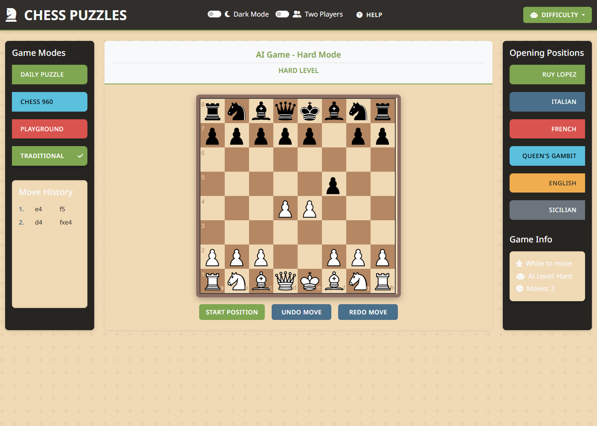

# chessPuzzlesJS

A browser-based chess app with five AI difficulty levels — including a custom-written JavaScript chess engine — daily puzzles, Chess960, a position playground, and one-click opening positions. It runs entirely client-side with no build step: open `index.html` or serve the folder statically.



## Features

**Game modes**
- **Traditional:** play standard chess against the computer, or against a friend with the Two Players toggle (same device).
- **Daily Puzzle:** puzzles come from a puzzles API (middlegame/advantage themes, rating around 1500), with a built-in set of puzzles used when the API is unavailable. The app plays the opening move, checks each of your moves against the stored solution, and replies with the opponent's move.
- **Chess960:** generates a random Fischer Random starting position (bishops on opposite colors, king between the rooks).
- **Playground:** set up any position with spare pieces; drag pieces off the board to remove them.
- **Openings:** one-click positions for the Ruy Lopez, Italian, French, Queen's Gambit, English, and Sicilian.

**Interface**
- Legal-move highlighting (normal moves, captures, checks), move history, undo/redo, game-over detection (checkmate, stalemate, repetition, insufficient material), dark mode, two-player same-device mode, and a help dialog.

## AI levels

| Level | How it plays | Engine |
|---|---|---|
| **Beginner** | Prefers a check, then a capture, otherwise a random legal move. | `main.js` |
| **Easy** | A shallow 2-ply search that deliberately doesn't always play its best move: 65% of the time it plays the best move found, 25% of the time one of its top 4 moves, and 10% of the time any legal move. | `ai.js`, in a Web Worker |
| **Medium** | Negamax search with alpha-beta pruning, depth 3, under a 1.5 s time limit. | `ai.js`, in a Web Worker |
| **Hard** | A custom chess engine (see below), thinking for about 2 s per move. | `engine.js`, in a Web Worker |
| **Grandmaster** | Asks a Stockfish 16 API for the best move, with local fallbacks if the call fails. After a game, a review compares your moves with the engine's suggestions. | `main.js` |

If a worker is unavailable or too slow to answer in time, each level falls back to a simpler one: Hard falls back to Medium, Medium falls back to a one-ply heuristic, and that heuristic falls back to Beginner-style play if it also fails.

## The Hard engine (`engine.js`)

`engine.js` is a self-contained chess engine written for this project. It does not use chess.js for move generation — chess.js remains the source of truth for the game itself (rules, legality of the player's moves, game-over detection), but the Hard level's search runs entirely on its own board representation.

**Board & move generation**
- 0x88 board representation with incremental Zobrist hashing and in-place make/unmake (no board copying per move).
- Legal moves are verified with perft against the published node counts for 6 standard test positions (the starting position and Kiwipete, positions 3 through 6), and cross-checked move-for-move against chess.js.
- Perft runs at roughly 6 million nodes/s in Node.

**Search**
- Iterative deepening with principal variation search.
- A transposition table with 2^20 entries.
- Quiescence search with delta pruning.
- Null-move pruning, late move reductions, and check extensions.
- Killer-move and history move ordering.
- Repetition and 50-move draw detection using the real game history.

**Evaluation**
- Tapered middlegame/endgame evaluation using PeSTO material values and piece-square tables.
- Passed, doubled, and isolated pawn terms; bishop pair; rooks on open files; mobility.
- King safety (pawn shield, attackers near the king).

**Opening book**
- 62 positions drawn from mainstream openings; the engine picks randomly among the book moves for a given position.

**Performance** (Node 22, i5-1135G7): about 340,000 nodes/s, reaching depth 7 in 2 s from a middlegame position; about 520,000 nodes/s, reaching depth 10 from the starting position. For comparison, the previous engine (now the Medium level) searched roughly 3,000 nodes/s in the browser, because it generated moves through chess.js.

## Running it

```bash
# any static server works; Web Workers need http://, not file://
python -m http.server 8000
# then open http://localhost:8000
```

Opening `index.html` directly from disk still works, but Web Workers are blocked on `file://` in most browsers, so the worker-based levels (Easy, Medium, Hard) fall back to simpler play.

### API keys

Daily Puzzle and Grandmaster use third-party APIs through RapidAPI. The app has built-in fallbacks for both, but to use the live APIs you need your own RapidAPI key. Because this is a static site, any key placed in client-side code is visible to visitors; use a key with a restricted quota, or put the calls behind a small proxy.

## Testing

Requires Node.js 22 or later, with no dependencies to install.

```bash
npm test   # node --test tests/*.test.js
```

This runs 101 tests covering engine move generation and perft, evaluation, search (tactics, time limits, the opening book), the Medium engine (`ai.js`), and the Easy move picker. One throughput test asserts at least 100,000 nodes/s; it can fail on a heavily loaded machine even though the engine itself is fine.

## Benchmarks

### Medium engine pruning benchmark

```bash
node bench/benchmark.js   # -> bench/results.json
```

Pruning benchmark for the Medium engine (`ai.js`), 9 positions: 3 opening, 3 middlegame, 3 endgame; one search per position; Node 22, i5-1135G7. Depth N includes iterations 1 through N, because the search deepens iteratively.

| Depth | Nodes, pruned | Nodes, unpruned | Nodes cut | Avg time/move, pruned | Avg time/move, unpruned | Speedup |
|---|---|---|---|---|---|---|
| 2 | 1,437 | 6,963 | 79% | 168 ms | 431 ms | 2.6× |
| 3 | 15,337 | 258,817 | 94% | 1.33 s | 17.8 s | 13.3× |
| 4 | 73,737 | (1 position only) | n/a | 9.6 s | 108 s (start position) | ~11× |

At depth 4, the unpruned search ran on the starting position only, because the full 9-position run would have exceeded the time budget. Pruned and unpruned searches returned the same score in every position, which confirms pruning doesn't change the result.

### Level ladder

```bash
node bench/ladder.js   # --games N, --hard-ms N, --selftest; writes bench/ladder-results.json
```

Each level plays the next one up from 5 opening positions with alternating colors, with draws adjudicated at 200 plies. A full run was interrupted by low memory on the machine it was run on, so these results are partial. Raw log of the interrupted run: `bench/ladder-partial.log`; a complete run writes `bench/ladder-results.json`.

| Match | Score | Elo gap (estimate) | 95% lower bound |
|---|---|---|---|
| Easy vs Beginner (20 games, 20 W / 0 D / 0 L) | 100% | ≥ 636 (sweep, bound) | ≈ 395 |
| Medium vs Easy (18 games, 17 W / 1 D / 0 L) | 97.2% | ≈ 618 | ≈ 375 |
| Hard vs Medium | — | pending | — |

Adjacent levels so far are clearly separated in strength. Hard's rating relative to Medium has not been measured yet; run `node bench/ladder.js` to complete it. These are relative rating estimates, anchored on Medium ≈ 1200 as a design-based estimate — not ratings measured against rated opponents.

## Tech stack

JavaScript (the engine is written in an ES5 style for broad compatibility; the UI uses ES6), [chess.js](https://github.com/jhlywa/chess.js) 0.x for rules and move generation, [chessboard.js](https://chessboardjs.com/) for the board UI, jQuery, Bootstrap 5, Web Workers, and Node's built-in test runner.

## Project layout

```
index.html        UI shell
main.js           Game modes, controls, difficulty logic, puzzles, Chess960
main.css          Styles
ai.js             Medium-level negamax / alpha-beta engine and evaluation
ai-worker.js      Web Worker wrapper around ai.js
engine.js         Hard-level engine: board, search, evaluation, opening book
engine-worker.js  Web Worker wrapper around engine.js
chess.js          Third-party rules library (BSD license, Jeff Hlywa)
tests/            ai, easy, engine-board, engine-eval, and engine-search tests
bench/            benchmark.js (pruning benchmark + results.json), ladder.js,
                  ladder-partial.log (raw log of the interrupted ladder run)
docs/             design spec, implementation plan, images
img/              board and piece images
package.json
LICENSE
```

## Known limitations

- Chess960 castling: chess.js 0.x assumes rooks start on the a and h files, so castling may not work correctly in Chess960 positions where they don't.
- Pawn promotion always promotes to a queen for the player.
- The Grandmaster review compares your moves with the engine's *predicted reply*, so its output is approximate.
- The Medium level (`ai.js`) looks at most three plies ahead with no quiescence search, so it can misjudge positions with pending captures.
- The Hard engine has no endgame tablebases and no pondering.
- Daily Puzzle and Grandmaster depend on third-party APIs, with built-in fallbacks when they're unavailable.

## License

MIT. `chess.js` is included under its own BSD license.
